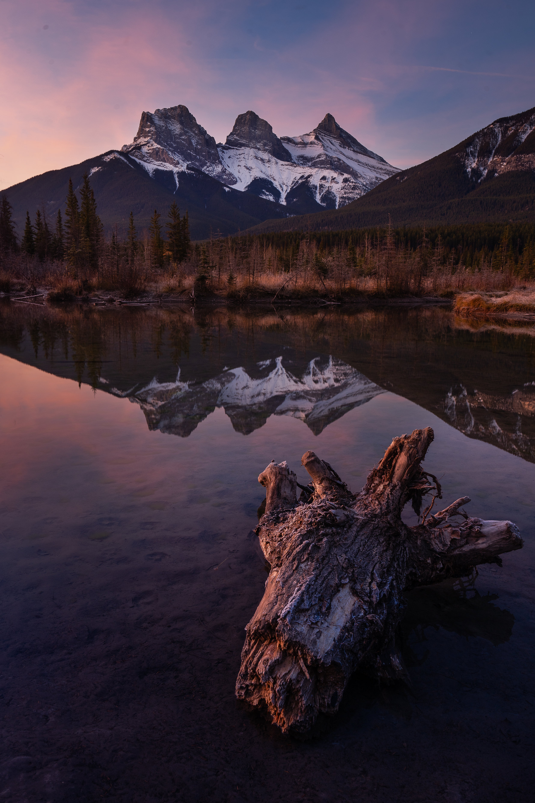
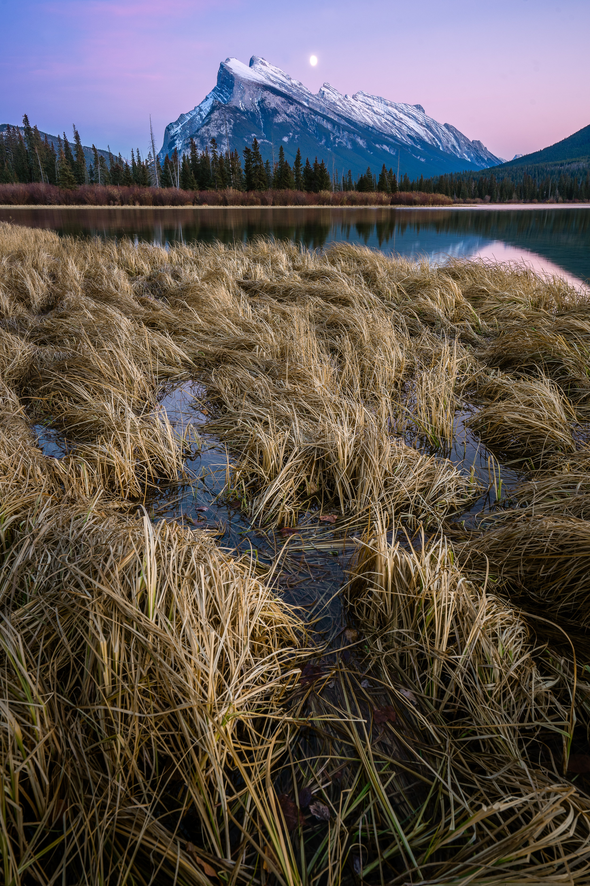
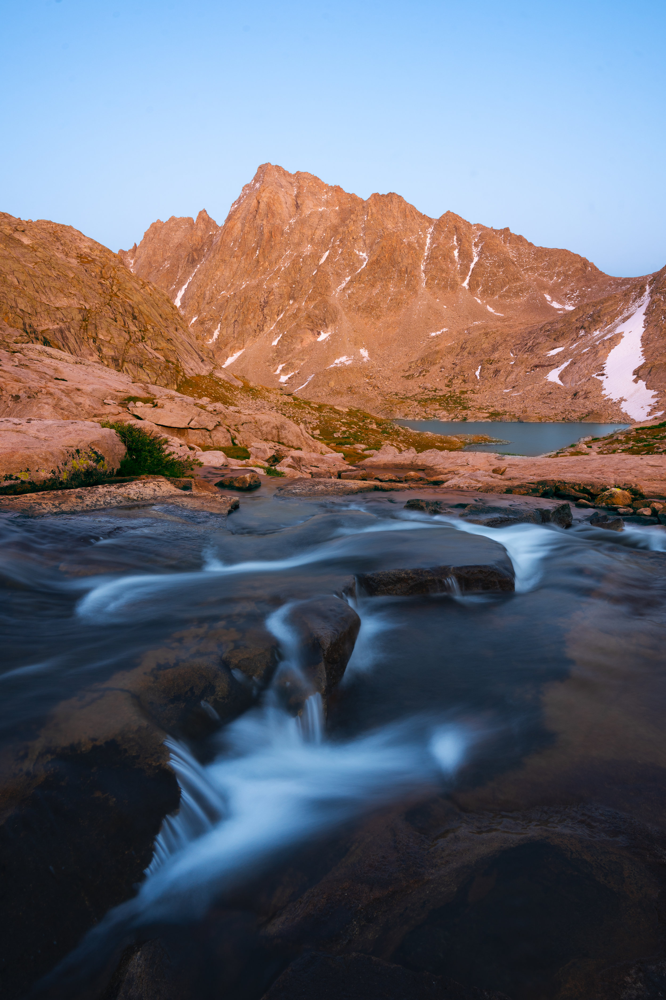
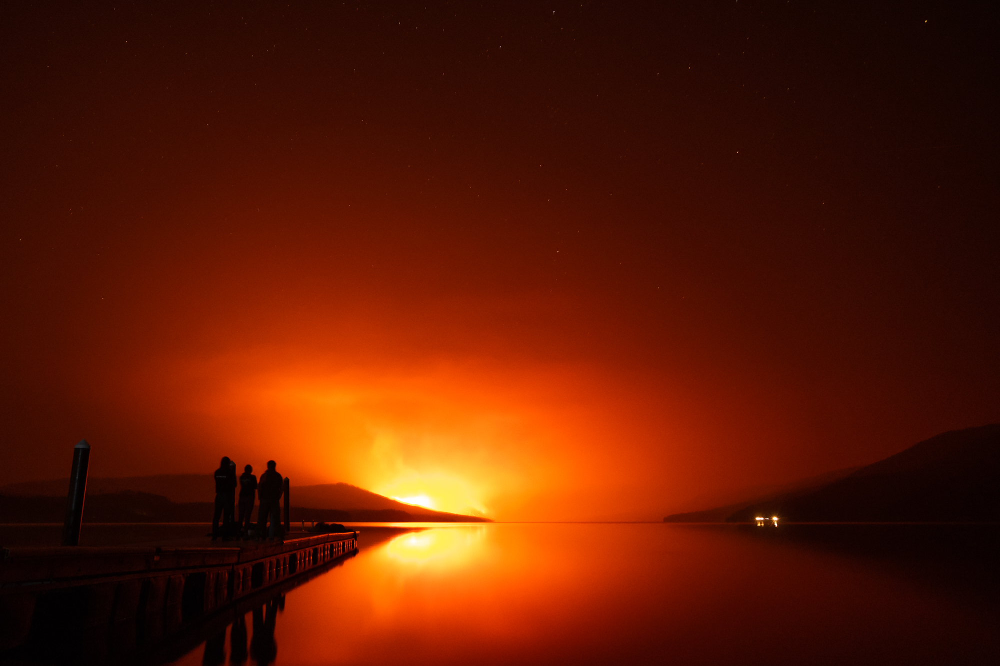
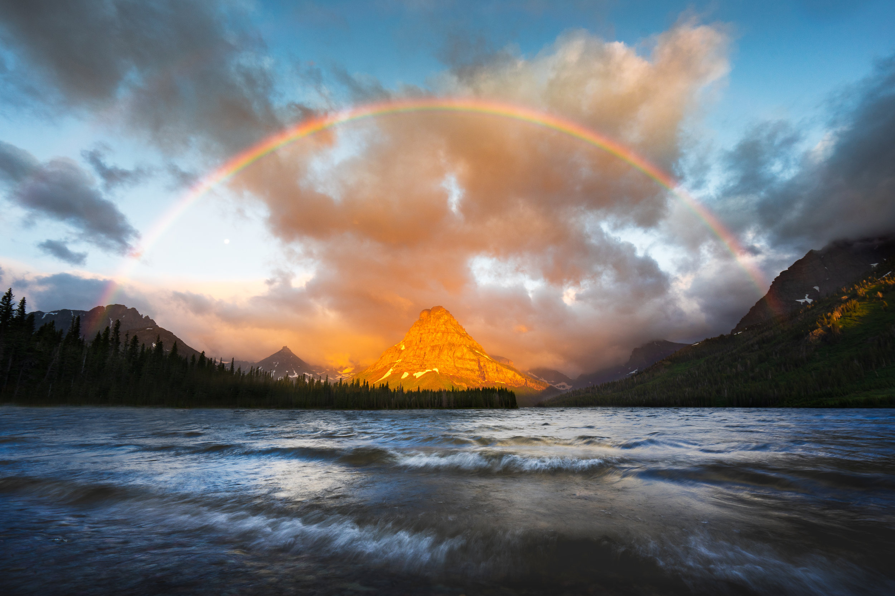

Yes, I know I’m a few days late on this and it’s time to move on to 2019. But for me as a photographer, 2018 was a huge year. I started shooting in July of 2017 but didn’t start taking things seriously until last January. And the photos were rough then – there’s been a lot of terrible images and mistakes and learning experiences – so it’s exciting to go through and see the ways I’ve improved over 12 months.

Here’s my five favorite images from 2018 (in no particular order):

## Three Sisters sunrise

A family vacation to Canmore, AB of course meant fantastic photo opportunities for me, and this was the first image I took during my vacation. These are the Three Sisters (Hope, Faith and Charity) that tower over Canmore. I arrived and started shooting just as the faintest dawn light started coming out of the east. I have frames with stars, direct light on the peaks and small but puffy clouds hanging directly over the Sisters, but my favorite shot came just before the sun inched over the horizon. I like the pink and blue tones in the sky – those colors are what I always strive for – and the fantastic reflection in the middle third of the image. A few weeks earlier and the aspens across the pond would have made this image better.

There’s always next year.

## Moonrise over Mount Rundle

This image came from the same trip as the previous photo but was shot at sunset at the very popular Vermillion Lakes area just outside Banff. I arrived with my girlfriend just before sunset and hoped to get some clouds behind Rundle and some direct light right on the peak. The light was disappointing and the clouds didn’t come, but the sky started to get interesting in the blue hour and I was satisfied with what I got. As I started packing up my girlfriend exclaimed, “The moon!” and I turned around to see the moon peeking out from the highest part of the ridgeline. We waited another fifteen minutes or so to get the moon in this position, but what was crazy is how fast the moon moved relative to the mountain!

I love the colors in the sky as well as the detail in the foreground. It’s a good memory and a photo I’m proud of.

## Ellingwood Peak

This shot came from a backpacking trip into the Wind River range with my friend and mentor, Rick Laverty. After hiking about 12 miles to our campsite the day before and another 10 or so to climb the nearby Fremont Peak (behind me in this image), we searched around the Indian Basin region for a good sunset spot and settled in for a couple hours.

This image comes just after sunset. I shot a horizontal image of the same peak from just a bit above this, with a reflection in a small pond, but after sunset we moved a little further and found this stream while the light was still hitting Ellingwood Peak. The sky could be more interesting but this photo makes me happy every time I look at it

## Howe Ridge fire

This photo came from more unfortunate circumstances than the last few. Glacier National Park was no exception to the fires that plagued the west over the summer. Upon the Howe Ridge fire igniting along the shores of Lake McDonald, I decided to head out around midnight and see the flames for myself.

I was not alone, as dozens of travelers and locals sat along the beach and watched the fire with me through the night. It took many tries to get the people along the dock to sit still enough for my long exposure, but I love the silhouettes against the orange glow. It’s not a pleasant scene, but it’s something different and a very real part of living in Montana and the American West.

## Rainbow over Sinopah

In terms of “wow” factor, I think this one wins for me.

Rick and I headed out to the Two Medicine area in Glacier early in the summer to shoot the nearby Running Eagle Falls at sunrise. The shot was fine, but storms had hovered over the park on our way in and we were curious to see what the views at the lake were like while the golden sunrise light still shone. As we pulled up to the lake we couldn’t believe what we were seeing, and I remember thinking I’d already taken my best photo as I scrambled to get as many usable frames as I could of the rainbow and the light. We followed the sunrise by hiking Rising Wolf peak, which brought some of the weirdest weather I’ve seen in Glacier.

Let me know what you think of my 2018 favorites and be sure to check out my Instagram for all the adventures 2019 will hold!
