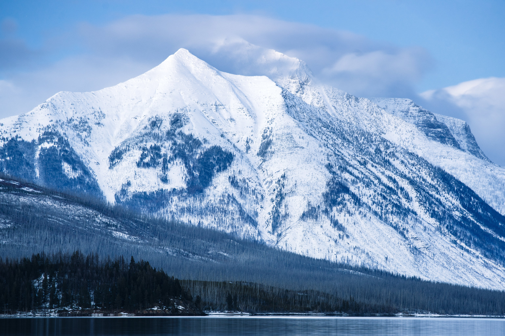
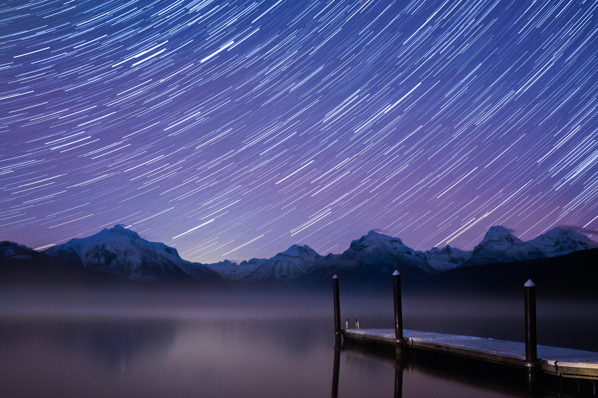
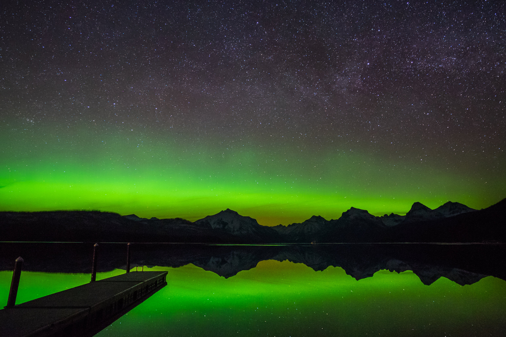
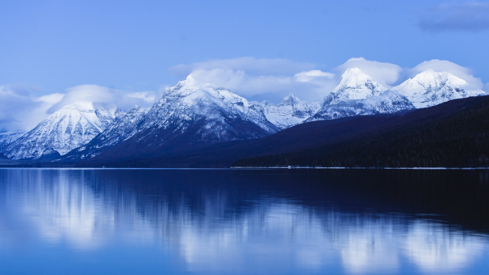

### As a landscape photographer, I’m always looking forward to new locations, new epic photos, new adventures.

But there’s something to be said for finding a location and returning to it again and again.

Here in Montana, we’re in the full swing of winter and most of Glacier National Park is shut off to all but the most determined skiers. The most accessible spot in Glacier is always Lake McDonald, so it’s naturally where a lot of us come back to again and again to shoot throughout the year. More than a few times I’ve shot at McDonald and thought, “That’s the one, I never need to come back here.” I don’t want to have multiple shots of the same spot on my portfolio (I do), so like I mentioned before, I’m always trying to get something new.

But so far, something new has always popped up on every trip to McDonald.

For one, I’ve been going since I picked up a camera less than two years ago. Since then, my photography has grown immensely and returning to locations has provided evidence of my progress. Every time you return to a location, you return as a different photographer. You bring new ideas, even in the span of a few days. You have new experiences, maybe you learned new techniques or maybe you got a new lens. 
You’re constantly changing as a photographer, even if you don’t realize it, and using a location as a benchmark helps that growth become more evident. In this shot of the lake just before dawn, I arrived early at the park to shoot my first astro-landscape composition before hiking into Avalanche Lake shortly after. I still like the result, and I think it holds up, but I had nearly no idea what I was doing and I’m happy to admit that. The ISO level on my crop-sensor camera produced some odd color noise in the peaks, and I didn’t know enough about planning a shot to realize the early, pre-dawn light would blow up the sky and reduce the stars in my image.

> You’re constantly changing as a photographer, even if you don’t realize it, and using a location as a benchmark helps that growth become more evident.

The difference is seen in the photo below, which came about one year later. The image is composed, with a foreground subject that leads the viewer’s eye out into the mountains, the shot was planned to avoid any dawn or moonlight, and it uses star trails to make a Milky Way-less night sky more interesting.

Maybe you favor the former over the latter, but there was a huge difference between what was going on behind the viewfinder.

Likewise, the landscapes we love will always be different when we return. No two sunsets are the same, and clouds and other weather conditions can completely transform the mood of a scene. Consider this shot of the dock leading out to the peaks at the head of Lake McDonald, taken during a flash of the Aurora Borealis last winter, and the image below, taken from the same spot but during the Howe Ridge fire last summer. The difference in weather and conditions is obvious, but both photos came as a result of continuously shooting and returning to this iconic spot again and again and again. Each time I went, I gained a better understanding of the location and what to expect from it, and by the time the fire blew up I already had the resulting image in my mind’s eye before I left my house. Just because we got a great image from a location doesn’t mean it’s the only image we can get.

Finally, keep returning to locations you love because, well, you love them. Your camera is there for your enjoyment. It’s not meant to pressure you or get you down if an image doesn’t turn out the way you want.

Go to the places that bring you enjoyment and keep going.

